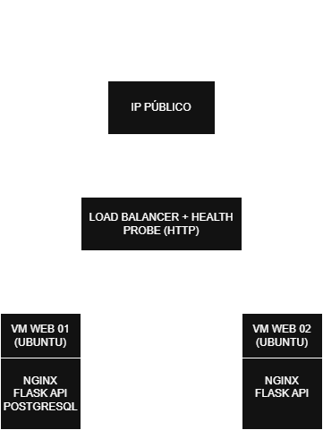

# Azure IaaS E-commerce

> Projeto: Simulação de e-commerce com arquitetura IaaS no Azure


---

## Resumo

- 2 VMs Linux em Availability Set
- Load Balancer distribuindo tráfego HTTP
- Backend Flask com Nginx
- PostgreSQL 16 rodando em VM (modelo IaaS, sem uso de PaaS)
- Monitoramento com Azure Monitor

---

## Visão Geral

Arquitetura de e-commerce baseada em IaaS no Azure, simulando alta disponibilidade usando Load Balancer e Availability Set.

Este projeto demonstra:
- Provisionamento manual de infraestrutura
- Configuração de rede segura (NSG)
- Balanceamento de carga em VMs Linux
- Deploy de aplicação Flask com Nginx

---

## Sobre o Projeto

O projeto está sendo desenvolvido como parte dos meus estudos em cloud computing e também para colocar em prática conhecimentos obtidos através dos estudos para a certificação AZ-900. Foco na aplicação de conceitos de Infrastructure as a Service (IaaS), alta disponibilidade e organização de recursos em ambiente cloud, não contemplando inicialmente aspectos avançados de frontend ou experiência do usuário.

### Objetivos (planejamento)

- [ ] Implementar arquitetura de 3 camadas (Frontend, Backend, Database)
- [ ] Configurar alta disponibilidade com Load Balancer e Availability Sets
- [ ] Aplicar segurança em camadas com NSG
- [ ] Implementar monitoramento e alertas com Azure Monitor
- [ ] Otimizar custos visando SLA de 99.95%
- [ ] Documentar todo o processo

---

## Diagrama de Infraestrutura (planejamento)

Diagrama da infraestrutura planejada:



---

## Componentes (planejamento)

| Camada | Componente | Função | 
| ------ | ---------- | ------ |
| Load Balancing | Azure Load Balancer (Standard SKU) | Distribuir tráfego HTTP
| Computação | 2x VMs Ubuntu B2ts_v2 + Availability Set | Hospedagem da aplicação
| Aplicação | Nginx + Python/Flask | Reverse proxy + API REST
| Database | PostgreSQL 16 rodando em VM | Armazenamento persistente
| Rede | VNet + Subnet + NSG | Isolamento e segurança
| Monitoramento | Azure Monitor + Alertas | Observabilidade

---

## Tecnologias a serem utilizadas

- Cloud: Microsoft Azure (IaaS)
- SO: Ubuntu Server 24.04 LTS
- Web Server: Nginx 1.18+
- Runtime: Python 3.11
- Framework: Flask
- Database: PostgreSQL 16
- Orquestração: Systemd
- Monitoramento: Azure Monitor

---

## Processo de Implementação

### Fases

| Fase | Descrição |
|------|-----------|
| 1 | Fundação (Rede + NSG) |
| 2 | Load Balancer |
| 3 | VMs |
| 4 | Stack (Nginx + Python + PostgreSQL) |
| 5 | Database |
| 6 | Monitoramento |
| 7 | Testes | 

---

## Estrutura do Repositório

```
az-iaas-ecommerce/
├── README.md                 # Este arquivo
├── .gitignore                # Ignora arquivos sensíveis
├── docs/                     # Documentação detalhada
├── diagrams/                 # Diagramas de arquitetura
├── screenshots/              # Evidências da implementação
├── scripts/                  # Scripts e configurações
├── infrastructure/           # Futuro IaC
└── costs/                    # Análise de custos
```

---

## Passos Realizados (Fase atual)

**Fase 1 - Fundação**
1. Criar Resource Group
2. Criar VNet e Subnet
3. Configurar NSG com regras de entrada
4. Associar NSG à Subnet

**Fase 2 - Load Balancer**
1. Criar Load Balancer Standard SKU
2. Configurar IP Frontend (associar ao IP Público do load balancer criado)
3. Criar pool do backend
4. Configurar Health Probe (HTTP GET / 15s, limite 2) e Regra de Balanceamento (frontend --> backend - TCP/80)

**Fase 3 - VMs**
1. Provisionar e configurar VM1
2. Provisionar e configurar VM2
3. Criar IPs públicos temporários para as VMs
4. Testar acesso às VMs via SSH
5. Verificar se as VMs estão associadas ao pool de backend e ao availability set

**Fase 4 - Stack**
1. Configuração do serviço Nginx nas duas VMs
2. Configuração do serviço da API nas duas VMs
3. Configuração do banco de dados (PostgreSQL) na VM1
4. Criação de .env e .gitignore no diretório do projeto
5. Criação de .env.example para mostrar um exemplo de .env para o leitor

**Fase 5 - Database**
1. Configuração da conexão da API na VM2 com o database da VM1
2. Configuração do PostgreSQL na VM1 para permitir acesso remoto
3. Criação de regra de entrada no NSG para permitir a conexão entre as VMs (database)
4. Exclusão dos IPs temporários das VMs
5. Inclusão dos arquivos utilizados nas VMs na estrutura do repositório

---

## Resultados Esperados

- Aplicação altamente disponível (simulação)
- Balanceamento de carga funcional
- Monitoramento ativo com alertas
- Arquitetura funcional, documentada e otimizada
- Acesso SSH restrito
- Regras de segurança mais restritas possível

---

## Resultados Reais (Fase atual)

- Rede virtual configurada com isolamento
- NSG aplicado com regras de entrada restritivas
- Estrutura inicial de recursos criada
- Load Balancer criado e configurado
- Regras de Balanceamento criadas e prontas para uso
- Availability Set criado e configurado (2 FD e 5 UD) para atingir alta disponibilidade
- VMs provisionadas e configuradas na rede
- SLA de 99.95% alcançado através da distribuição das 2 VMs no conjunto de disponibilidade
- VMs configuradas e funcionando conforme o esperado

---

## Decisões de Arquitetura

- Apesar de não ser o ideal, utilizei duas VMs e um database dentro de uma dessas VMs devido ao custo do projeto
- Essa decisão impacta minha alta disponilidade, pois a VM1 é ponto de falha (se ela cair, tudo cai)
- Para um projeto futuro, espero ter orçamento para poder implantar um scale set, usando master/slaves para o database e implantar cache na minha aplicação
- Uso de quatro tags para organizar os recursos e controlar custos desse projeto (Projeto, Ambiente, Owner e CC)
- Grupo de Recursos e Recursos foram criados na região Central US porque era a única região que minha assinatura tinha quota para VMs mais baratas
- A ser implementado: método de segurança para restringir o acesso via SSH (melhorar o controle de acesso mínimo)
- Configuração de Health Probe (HTTP GET / 15s, limite 2) para verificar integridade das VMs durante a atividade
- Uso de IPs públicos temporários para as VMs para possibilitar conexão e configuração antes do resultado final
- VM2 não terá o postgresql instalado, pois apenas conectará no database da VM1 através da API

---

## Aprendizados

**Fase 1 - Fundação**
- Criação de Grupo de Recursos com tags para organização
- Criação e configuração de VNet e Subnet para futura comunicação entre recursos
- Configuração de regras de entrada do NSG para restringir acesso aos recursos da rede
- Criação de IP público
- Importância de planejar a região a ser utilizada baseado em quotas

**Fase 2 - Load Balancer**
- Criação e configuração de Load Balancer
- Entendimento de que o pool de backend pode ser inicialmente provisionado vazio
- Health Probe é necessário para failover (2 testes sem resposta --> VM sem saúde)
- Regra LB: frontend (porta 80) --> backend (porta 80)

**Fase 3 - VMS**
- Criação e configuração de Conjunto de Disponibilidade com 2 domínios de falha e 5 domínios de atualização
- Criação e configuração de VMs
- Conexão via SSH a um servidor
- Configuração de permissões de usuários para leitura de arquivos .pem (chaves SSH)
- Comandos básicos do Powershell e do Linux
- Auto-shutdown para as VMs evitando gastos desnecessários

**Fase 4 - Stack**
1. Configuração do serviço Nginx com backup e alteração da configuração padrão do Nginx (reverse proxy)
2. Configuração do serviço da API para rodar sem precisar de app.run()
3. Criação e configuração do Database básico do ecommerce
4. Criação dos arquivos .env e .gitignore para ocultar as variáveis de ambiente
5. Aprendizado de comandos bash para criação e verificação de serviços

**Fase 5 - Database**
1. Configuração do PostgreSQL para habilitar conexões remotas
2. Configuração de regra de segurança dentro da própria subnet
3. Comandos bash e familiaridade com o PostgreSQL via terminal

---

## Desafios

**Fase 1 - Fundação**
- Verificar antecipadamente em qual região o projeto seria implementado para otimizar os custos, já que a região escolhida é baseada nas quotas disponíveis para tamanhos de VM com menor custo na assinatura (Família B2ts_v2 disponível, infelizmente a B1s não)
- Entender prioridade do NSG

**Fase 2 - Load Balancer**
- Entender que o uso do pool de backend
- Entender a diferença entre Health Probe e a Regra de Balanceamento

**Fase 3 - VMs**
- Entender os requisitos e o funcionamento de uma conexão SSH
- Entender como funciona as permissões para usuários no Windows e no Linux

**Fase 4 - Stack**
- Troubleshooting da VM1, pois ela ficou inoperante por um tempo (sobrecarregada)
- Adentrar mais no uso dos comandos do terminal para conversar com o sistema
- Entender mais sobre a conexão na fase atual e o que seria possível testar

**Fase 5 - Database**
- Descobrir o motivo da VM2 não conectar na VM1 de primeira (regra do NSG)
- Navegar pelo PostgreSQL para conseguir refazer o script que criou e populou o database

---

## Sugestões de Melhoria

- Melhoria na arquitetura (simples, apenas para teste)
- Automatizar a criação de VMs (idênticas) através de IaC
- Automatizar a configuração dos serviços das VMs, pois foram criados repetidamente na VM1 e VM2

---

## Autor

Bruno Kraker

- GitHub: [@bruno-kraker](https://github.com/BrunoKraker)
- LinkedIn: [Bruno Kraker](https://www.linkedin.com/in/brunokraker/)

---

## Status do Projeto

- Fase atual: Desenvolvimento
- Próximo passo: Fase 6 - Monitoramento
- Última atualização: 17/05/2026